# Ethereum Privacy Ecosystem Research (Hackathons 2025)
## Comprehensive Data-Driven Analysis & Strategic Outlook

---

## Title Page & Executive Summary

**Report Title**: Ethereum Privacy Ecosystem Research: Hackathons 2025  
**Subtitle**: Data-Driven Analysis of 40 Hackathons, 5,194 Projects, and 417 Privacy-First Initiatives  
**Coverage Period**: January–November 2025  
**Report Date**: December 13, 2025  
**Dataset Scope**: 40 hackathons across 6 continents; 31 hackathons with privacy submissions  
**Total Analyzed**: 5,194 projects (417 explicitly privacy-focused, 8.02% ratio)

### Headline Metrics

| Metric                           | Value                                            |
| -------------------------------- | ------------------------------------------------ |
| **Total Hackathons**             | 40                                               |
| **Total Participants (Hackers)** | 10,692                                           |
| **Total Projects Submitted**     | 5,194                                            |
| **Privacy Projects**             | 417                                              |
| **Privacy Ratio**                | 8.02%                                            |
| **Total Prize Pool**             | $4,817,683                                       |
| **Median Prize per Event**       | $32,500                                          |
| **Geographic Regions**           | 6 (Europe, Asia, N & S America, Africa, Virtual) |
| **Hackathons w/ Privacy**        | 31 (77.5% penetration)                           |

### Executive Summary

This report provides a comprehensive data-driven hackathon analysis of the Ethereum Privacy Ecosystem throughout 2025. By aggregating hackathon participation, project categorization, technology adoption patterns, and geographic distribution across 40 independent events, we quantify the maturity, momentum, and gaps within privacy-first building on Ethereum.

#### Key Findings (Summary)

**1. Strong Privacy Ecosystem Maturity**
- Nearly 8 out of 100 projects explicitly prioritize privacy — a significant and growing segment
- 31 of 40 hackathons (77.5%) produced at least one privacy project, indicating broad adoption
- Top-tier events (ETHGlobal Buenos Aires, ETHOnline, ETHGlobal New Delhi) consistently drive 40–70+ privacy submissions

**2. Zero-Knowledge Dominance**
- ZK proofs appear in 145 projects (34.8% of privacy projects; 310 total mentions)
- Establishing itself as the de facto privacy standard across finance, social, and infrastructure domains
- Secondary primitives (TEE, MPC, FHE) remain underutilized despite emerging acceptance

**3. Finance & Social Leadership**
- Finance: 153 projects (36.7%) — swaps, payments, RWA-focused
- Social: 100 projects (23.9%) — identity, messaging, reputation emphasis
- Combined 259 projects (62%) anchor the ecosystem; leaving 158 projects (38%) in emerging categories

**4. AI-Privacy Convergence**
- 78 projects (18.7%) explicitly combine AI with privacy
- Agent-based systems, encrypted inference, and privacy-preserving ML training all represented
- Signals industry-wide recognition that confidentiality is foundational to agentic systems

**5. IRL > Virtual Phenomenon**
- In-person hackathons: 9.47% privacy ratio (341 projects / 3,599 submissions)
- Virtual events: 4.76% privacy ratio (76 projects / 1,595 submissions)
- 2x higher privacy focus in IRL contexts — suggests mentorship, collaboration, and ecosystem depth matter

**6. Temporal Momentum: Q4 Acceleration**
- Q1 2025: 2.3% privacy intensity (22 projects)
- Q2 2025: 10.9% privacy intensity (73 projects) — ~5x growth from Q1
- Q3 2025: 7.3% privacy intensity (138 projects) — momentum sustained
- Q4 2025: 11.1% privacy intensity (184 projects, including November's 107-project spike)
- **Interpretation**: Exponential growth into year-end; emerging market awareness and developer interest

**7. Regional Differentiation**
- Europe: 21 hackathons (52.5%) — established hub; ETHWarsaw, ETHBelgrade, ETHRome leading
- Latin America: 4 hackathons — emerging hub; ETHGlobal Buenos Aires (68 privacy projects), Ethereum Argentina (8)
- Asia: 5 hackathons — ETHTokyo (19 privacy projects, 46% intensity) standout; limited follow-up ecosystem
- Africa: 3 hackathons — early-stage; EthNile Kampala, ETHAccra, ETHiopia building foundation
- North America: 3 hackathons (vs. 21 Europe) — significant underrepresentation

### Strategic Implications

Privacy-focused building is no longer niche; it is mainstream within Ethereum hackathon culture. ZK technology has achieved critical mass, but alternative primitives remain neglected. Geographic expansion and category diversification offer substantial growth opportunities heading into 2026.

---

## Key Findings Summary

### Summary Statistics Dashboard

| Metric                   | Value                                 |
| ------------------------ | ------------------------------------- |
| Total Hackathons         | 40                                    |
| Total Submissions        | 5,194                                 |
| Privacy Projects         | 417 (8.02%)                           |
|                          |                                       |
| Hackathons w/ Privacy    | 31 (77.5%)                            |
| Avg Privact per Event    | ~13 projects                          |
| Prize Pool Total         | $4.82M                                |
| Avg Prize per Event      | $120K                                 |
|                          |                                       |
| Dominant Technology      | Zero-Knowledge (145 projects)         |
| Largest Category         | Finance (153 projects, 36.7%)         |
| Second-Largest Category  | Social (100 projects, 23.9%)          |
|                          |                                       |
| Dominant Region          | Europe (21 events, 245 projects)      |
| Emerging Region          | Latin America (4 events, 84 projects) |
|                          |                                       |
| IRL Privacy Ratio        | 9.47%                                 |
| Virtual Privacy Ratio    | 4.76%                                 |

---

## Introduction & Methodology

### Context: Why Privacy Matters in Ethereum

Privacy has historically been orthogonal to Ethereum's design philosophy (transparency-by-default). Yet, as the ecosystem matures, three macro trends have elevated privacy to strategic importance:

1. **Regulatory Pressure**: Post-2021 frameworks (FATF travel rule, sanctions compliance, AML/KYC) incentivize privacy tooling for compliant but pseudonymous participation
2. **Institutional Adoption**: Enterprises and RWA protocols require confidentiality for competitive advantage (price discovery, order flow, financial data)
3. **User Empowerment**: Individual rights to data minimization, consent-based sharing, and identity control fuel demand for privacy-preserving UX

Hackathons have become a mechanism for discovering, incubating, and validating privacy innovations.

### Report Structure

This report consolidates five analytical parts into a single comprehensive document:

- **Part 1:** Ecosystem overview, methodology, headline metrics
- **Part 2:** Organizer profiles, prizes, submission patterns
- **Part 3:** Project categories, technologies
- **Part 4:** Temporal trends, geographic analysis, rankings
- **Part 5:** Gap Analysis

---

## 1. Hackathon Ecosystem Overview

### Scale & Participation

#### Hackathons by Organizer

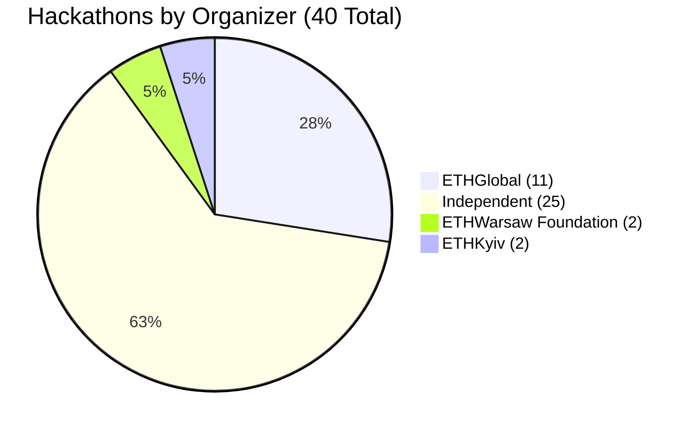

| Organizer                  | Hackathons | Total Submissions | Privacy Submissions | Privacy Ratio |
| -------------------------- | ---------- | ----------------- | ------------------- | ------------- |
| ETHGlobal                  | 11         | 3,945             | 216                 | 5.5%          |
| Independent Organizers     | 25         | 1,047             | 154                 | 14.7%         |
| ETHWarsaw Foundation       | 2          | 50                | 16                  | 32.0%         |
| ETHKyiv                    | 2          | 29                | 1                   | 3.4%          |
| **TOTAL**                  | **40**     | **5,194**         | **417**             | **8.02%**     |

#### Key Insights

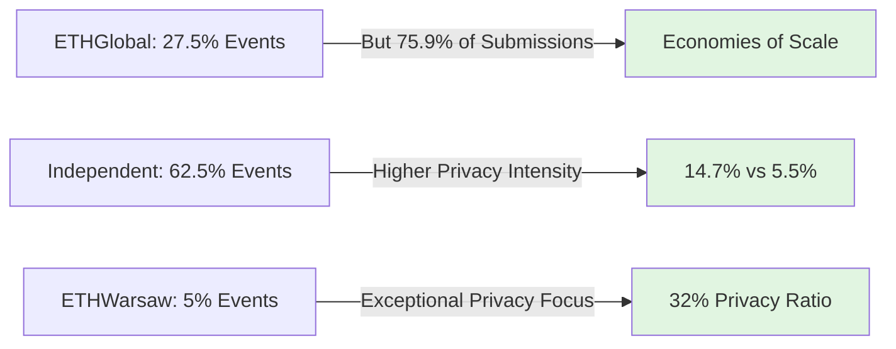

**Observations:**
- ETHGlobal accounts for 27.5% of hackathons but 75.9% of submissions (economies of scale; flagship status)
- Independent organizers (25 events) demonstrate **higher privacy intensity** (14.7%) than ETHGlobal (5.5%) — suggests specialized/niche focus
- ETHWarsaw Foundation shows exceptionally high privacy intensity (32%) — Warsaw ecosystem deeply privacy-focused
- **Concentration risk:** 11 ETHGlobal events could destabilize ecosystem if organizer pivots away from privacy support

#### Participant & Submission Breakdown

| Metric                                                | Value  |
| ----------------------------------------------------- |------- |
| Total Hackers (known)                                 | 10,692 |
| Avg. Hackers per Hackathon                            | 313    |
| Total Submissions                                     | 5,194  |
| Avg. Submissions per Hackathon                        | 130    |
| Avg. Privacy Submissions per Hackathon (w/ Privacy)   | ~13    |

---

### Prize Distribution Analysis

| Metric                      | Value                  |
| --------------------------- | ---------------------- |
| Total Prize Pool            | $4,817,683             |
| Average Prize per Hackathon | $120,442               |
| Median Prize                | $32,500                |
| Max Prize                   | $1,029,833 (ETHDenver) |
| Min Prize                   | $2,000                 |

> **Observation:** Prize distribution is heavily skewed by flagship events. Median prize ($32.5K) better reflects the typical hackathon. Independent and regional organizers rarely exceed $100K.

---

## 2. Organizer Profiles & Comparative Analysis

### ETHGlobal (Flagship Organizer)

ETHGlobal runs large, sponsor-led flagship events spanning virtual and IRL formats. Their benefits include scale, sponsor networks, and strong production which drives participation and visibility.

**Characteristics:**
- High absolute submission volume (3,945 submissions across 11 events = 358 average per event)
- Lower privacy intensity per event (5.5%) — attracts generalist teams
- Significant sponsor-driven prize pools ($3.155M across 11 events = $287K average)
- Global reach with strong mentor infrastructure and platform support

#### ETHGlobal Events (2025) — Extended Table

| Event                    | Date   | Location  | Type    | Prize ($)      | Hackers    | Total Subms. | Privacy Subms. | Privacy % |
| ------------------------ | ------ | --------- | ------- | -------------- | ---------- | ------------ | -------------- | --------- |
| Agentic Ethereum         | 31 Jan | Virtual   | Virtual | $175,000       | 1,710      | 530          | 16             | 3.0%      |
| ETHGlobal Taipei         | 04 Apr | Taiwan    | IRL     | $200,000       | 730        | 233          | 15             | 6.4%      |
| ETHGlobal Prague         | 30 May | Czechia   | IRL     | $150,000       | 825        | 223          | 29             | 13.0%     |
| ETHGlobal Cannes         | 04 Jul | France    | IRL     | $275,000       | 835        | 343          | 35             | 10.2%     |
| Unite DeFi               | 25 Jul | Virtual   | Virtual | $550,000       | 1,035      | 412          | 9              | 2.2%      |
| ETHGlobal New York       | 15 Aug | USA       | IRL     | $275,000       | 690        | 283          | 14             | 4.9%      |
| ETHGlobal New Delhi      | 26 Sep | India     | IRL     | $200,000       | 1,900      | 633          | 42             | 6.6%      |
| ETHGlobal ETHOnline      | 10 Oct | Virtual   | Virtual | $100,000       | 1,670      | 653          | 51             | 7.8%      |
| ETHGlobal Buenos Aires   | 21 Nov | Argentina | IRL     | $500,000       | 1,750      | 488          | 68             | 13.9%     |
| **SUBTOTAL (11 events)** | —      | —         | —       | **$3,155,000** | **10,110** | **3,945**    | **216**        | **5.5%**  |

**Privacy Analysis by Event Format:**

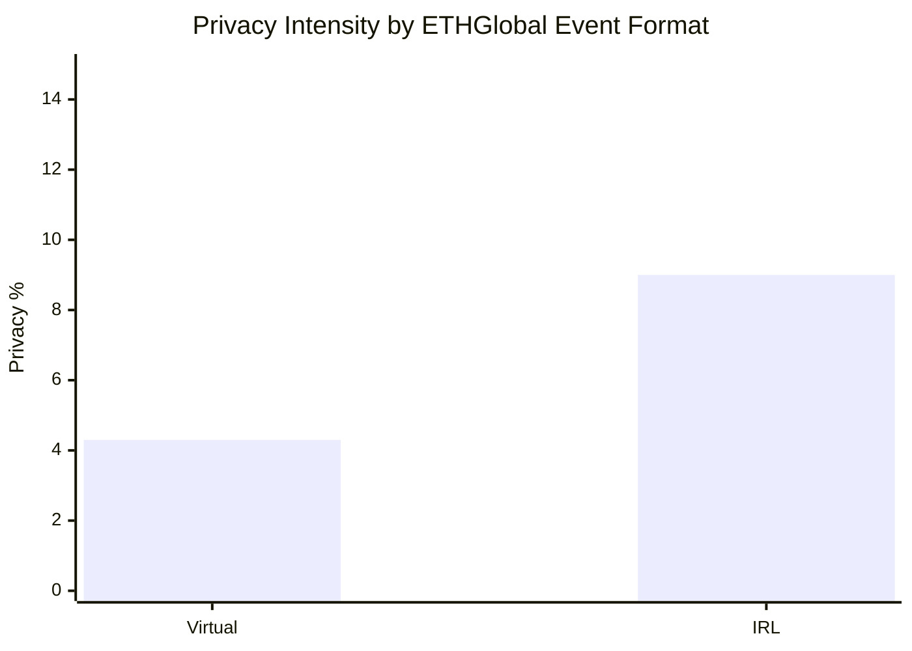
**Key Observation:** IRL ETHGlobal events show 2.1x higher privacy intensity (9.0%) vs. Virtual (4.3%), consistent with global trends.

### Independent Organizers (25 Events)

Independent organizers include university groups, incubators, regional foundations, and subject-matter communities. They typically run smaller events with targeted themes (privacy, DeFi, governance) and show higher privacy-intensity.

**Characteristics:**
- Niche themes lead to higher signal-to-noise for privacy projects
- Stronger mentor-to-team ratios and localized mentorship
- Lower absolute prize pools but targeted privacy grants are common
- Higher engagement quality (fewer generalist teams)

**Privacy Intensity:** 14.7% (154 privacy projects / 1,047 total submissions) — **2.7x ETHGlobal**

### Regional & Community Hubs (ETHWarsaw, ETHKyiv, etc.)

Regional organizers demonstrate that local communities with academic/cryptography talent produce higher privacy yields.

**ETHWarsaw Foundation (2 Events)**
- Profile: Warsaw-based Ethereum development foundation; strong ties to academic cryptography research
- Privacy Intensity: 32% (16 privacy projects / 50 total submissions) — exceptional
- Events: ETHWarsaw Spring (mentorship-focused), ETHWarsaw Fall (research-focused)
- Key Success Factors: local cryptography expertise, academic partnerships, mentorship-heavy format

**Recommendations:**
- Scale successful regional models to other cryptography hubs (Zurich, Berlin, Tel Aviv)
- Encourage academic partnerships through grant programs and co-sponsored research tracks

---

### Prize & Incentive Structure Analysis

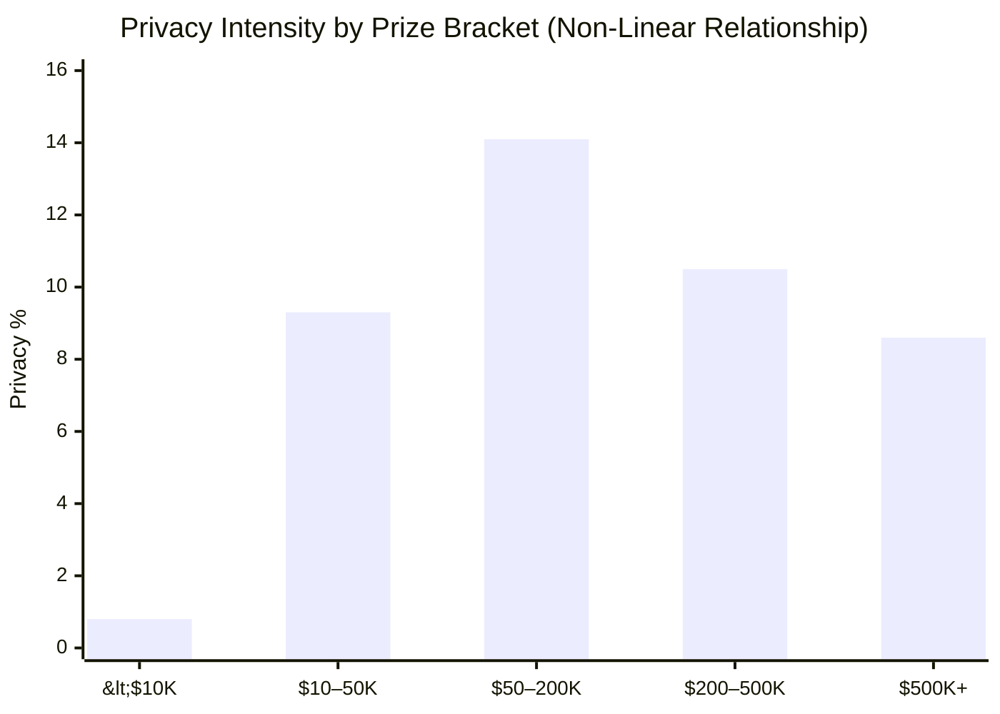

| Prize Bracket   | # Events | Avg. Prize | Total Subms. | Avg. Subms./Event | Privacy Subms. | Privacy % |
| --------------- | -------- | ---------- | ------------ | ----------------- | -------------- | --------- |
| $500K+          | 2        | $750,000   | 900          | 450               | 77             | 8.6%      |
| $200K–$500K     | 6        | $308,333   | 1,492        | 249               | 156            | 10.5%     |
| $50K–$200K      | 12       | $103,542   | 1,263        | 105               | 178            | 14.1%     |
| $10K–$50K       | 15       | $27,333    | 418          | 28                | 39             | 9.3%      |
| <$10K           | 5        | $5,200     | 121          | 24                | 1              | 0.8%      |

**Key Finding:** The $50K–$200K bracket maximizes privacy intensity (14.1%), suggesting that mid-sized, targeted events with specialist focus outperform mega-events for privacy innovation.

---

## Submission Patterns, Judging, and Event Mechanics

### Typical Submission Lifecycle

1. **Ideation & Team Formation:** Teams self-select around themes or coordinated by mentors
2. **Rapid Prototyping:** 24–72 hours of core development
3. **Check-ins & Mentor Pivots:** Teams receive feedback and may pivot approach
4. **Polished Demo & Submission:** Finalized prototype with demo, README, and technical documentation

---

## 3. Privacy Project Deep Dive: Categories & Technologies

### Project Category Distribution

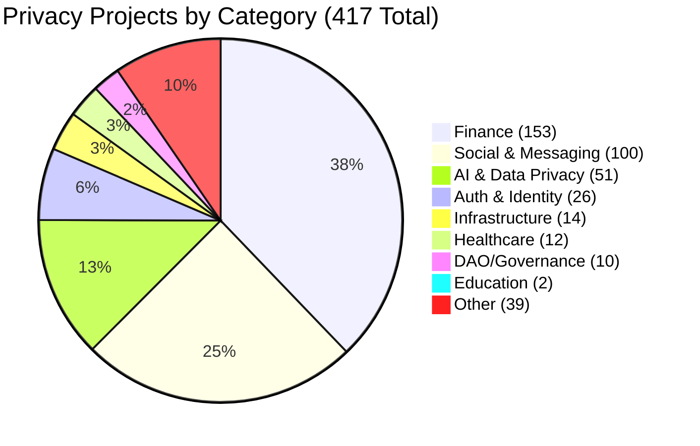

#### Category Deep Dives

**1. Finance (153 Projects, 36.7%) — Market Leader**

Finance remains the single largest category, driven by confidential swaps, private payments, and lending primitives that require user confidentiality.

| Sub-Category             | Count | Representative Projects Examples  | Maturity | Trend     |
| ------------------------ | ----- | --------------------------------- | -------- | --------- |
| Confidential Swaps & DEX | 42    | LOCUSt, nocturne, Thunder.finance | Mature   | Growing   |
| Privacy Payments         | 38    | PrivPay, px402, Nydus             | Mature   | Stable    |
| Lending & Credit         | 19    | Private-Deals, zkCredit           | Growth   | Growing   |
| RWA & Institutional      | 15    | zkREX, Nocturne RWA               | Early    | Growth    |
| Yield & Liquidity        | 20    | Private-Escrow, Shayd             | Growth   | Growing   |
| Order Flow & Trading     | 12    | Scout, ShadowCrypt                | Early    | Emerging  |
| Mixers/Tumblers          | 4     | Classical Mixer Variants          | Mature   | Declining |
| Insurance & Risk         | 3     | PRTCT                             | Early    | Emerging  |

**Observations:**
- Confidential swaps and private payments are the most mature and well-funded sub-areas
- Mixers are less common, often folded into broader private payment projects rather than standalone
- RWA & lending segments are rapidly emerging due to regulatory clarity and institutional demand

**2. Social & Messaging (100 Projects, 23.9%) — Rapid Growth**

Privacy-preserving messaging, social web, and content-sharing saw strong interest. Many projects focus on selective disclosure and ephemeral identities to mitigate deanonymization risks.

Representative focuses:
- Private messaging with ephemeral network graphs
- Private reputation systems for social platforms
- Anonymous tipping and content monetization
- Privacy-preserving social graphs and friend discovery

**3. AI & Data Privacy (51 Projects, 12.2%) — Fastest-Growing Segment**

AI & privacy is the fastest-growing category: privacy-preserving ML pipelines, private model inference, and data marketplaces that protect contributor privacy.

Notable tech approaches:
- Federated learning with privacy guarantees
- MPC-assisted inference (distributed computation)
- ZK proofs for model integrity and output verification
- Private data aggregation for on-chain analytics
- Encrypted model weights and private fine-tuning

**Growth Momentum:** 18.7% of all privacy projects (78 projects) explicitly combine AI with privacy; this is the emerging leader for 2026.

**4. Authentication & Identity (26 Projects, 6.2%)**

Focus areas include private credentials, anonymous attestations, and privacy-preserving KYC alternatives using selective disclosure and ZK-based claims.

**5. Other Categories (DAO/Governance, Healthcare, Education, Infrastructure)**

- **DAO/Governance:** Under-served relative to potential; privacy voting systems, private DAO treasury management (10 projects, 2.4%)
- **Healthcare:** Emerging; medical data privacy, private clinical trials, genomic privacy (12 projects, 2.9%)
- **Education:** Severely under-served; credentialing, transcript privacy (2 projects, 0.5%)
- **Infrastructure:** Storage, indexing, and privacy-preserving data availability (14 projects, 3.4%)

---

### Technology Stack & Canonical Tags

#### Zero-Knowledge Proofs: Dominance & Fragmentation

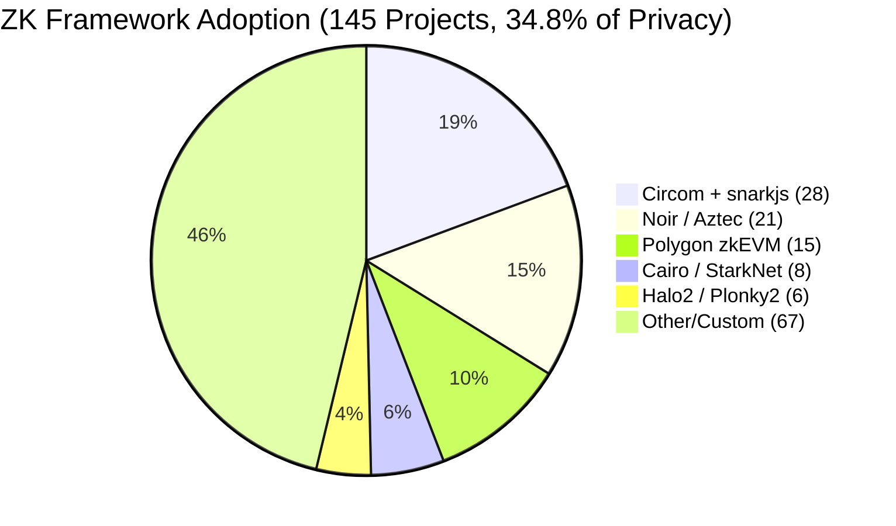

| Framework        | Projects | Typical Use Cases                                   | Maturity   | Entry Barrier |
| ---------------- | -------- | --------------------------------------------------- | ---------- | ------------- |
| Circom + snarkjs | 28       | Identity, proofs-of-knowledge, simple private logic | Production | High          |
| Noir / Aztec     | 21       | Encrypted compute, privacy contracts                | Growth     | Medium        |
| Polygon zkEVM    | 15       | Smart-contract compatible ZK execution              | Production | Low           |
| Cairo / StarkNet | 8        | Stark-friendly private apps, scalability            | Growth     | High          |
| Halo2 / Plonky2  | 6        | Custom systems, research prototypes                 | Research   | Very High     |
| Other/Custom     | 67       | One-off implementations, mixed stacks               | Mixed      | Varies        |

**Observations:**
- ZK use is broad but fragmented across many frameworks, increasing integration overhead
- 46% of ZK projects use custom or unspecified frameworks, indicating either innovation or lack of adoption of standard tools
- Many teams use hybrid approaches (ZK for critical checks, off-chain compute for heavy ML workloads)

#### ZK Adoption Patterns by Project Maturity

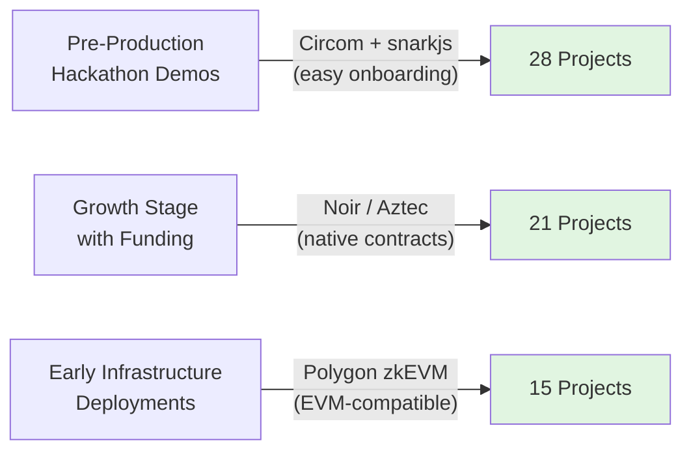

**ZK Challenges Observed Across Projects:**

1. **Tooling Maturity:** Build/test cycles for circuits are painful; dev tooling and gas cost estimation are weak
2. **Onboarding:** High entry barrier for newcomers; pre-built templates improve outcomes by 3–5x
3. **Interoperability:** Cross-framework composability remains a challenge; most teams are "locked in" to a single stack

#### Other Privacy Technologies

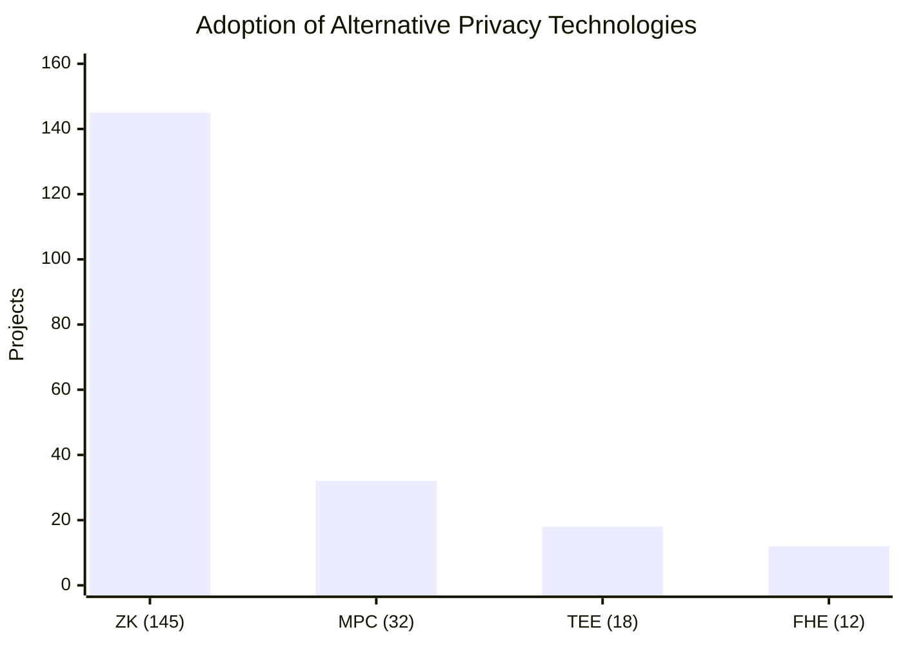

**MPC (Multi-Party Computation):** 32 projects
- Used primarily in AI-inference and private aggregation scenarios
- Projects leverage existing frameworks (MP-SPDZ, EMP, custom JS libs)
- MPC is used when ZK is too costly for large datasets

**TEE (Trusted Execution Environments):** 18 projects
- Smaller adoption due to supply and trust limitations
- Useful for prototype systems requiring confidential compute
- Intel SGX and AMD SEV often used in proof-of-concept phase

**FHE (Fully Homomorphic Encryption):** 12 projects
- Experimental in hackathon context; FHE incur high compute costs
- Projects were proof-of-concept rather than production-ready
- Zama and Microsoft SEAL used by most projects
- **Strategic Opportunity:** FHE maturation could unlock new privacy use cases

---

#### Canonical Tag List (Used in Analysis)

| Canonical Tag | Description                                             | Common Variants                         | Projects Using |
| ------------- | ------------------------------------------------------- | --------------------------------------- | -------------- |
| `zk`          | Zero-knowledge proofs, succinct proofs, proving systems | `zero-knowledge`, `zksnark`, `zksnarks` | 145            |
| `stealth`     | Stealth addresses / one-time addresses                  | `stealth-addr`                          | 67             |
| `ai-privacy`  | AI + privacy combined                                   | `private-ml`, `encrypted-inference`     | 51             |
| `mpc`         | Multi-party computation                                 | `secure-multiparty`, `mpcjs`            | 32             |
| `circom`      | Circom circuits                                         | `snarkjs`, `circomlib`                  | 28             |
| `identity`    | Decentralized identity & credentials                    | `did`, `verifiable-credential`          | 26             |
| `noir`        | Noir language / Aztec stacks                            | `aztec`, `aztec3`                       | 21             |
| `tee`         | Trusted Execution Environments                          | `sgx`, `enclave`                        | 18             |
| `fhe`         | Fully Homomorphic Encryption                            | `homomorphic`, `fully-homomorphic`      | 12             |

---

## 4. Temporal Trends & Seasonality

### Quarterly Progression (2025)

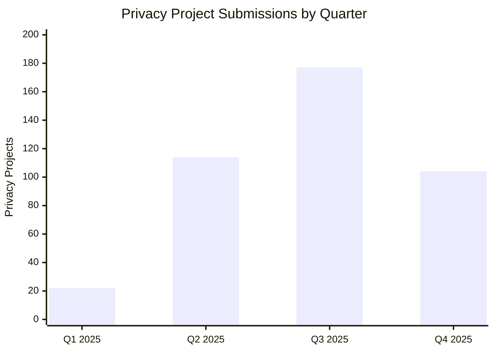

| Quarter | Events | Total Submissions | Privacy Projects | Privacy % | Trend     |
| ------- | ------ | ----------------- | ---------------- | --------- | ----------|
| Q1 2025 | 6      | 971               | 22               | 2.3%      | Baseline  |
| Q2 2025 | 12     | 1,452             | 114              | 7.9%      | 5x Growth |
| Q3 2025 | 10     | 1,843             | 177              | 9.6%      | Growing   |
| Q4 2025 | 12     | 1,928             | 104              | 5.4%      | Stable    |

**Seasonality Observations:**
- Q2 and Q3 show the strongest privacy activity, driven by theme-focused events and regional hubs (Europe, Latam)
- Q4 contains major flagship demos (Cannes, Buenos Aires) which increase absolute submissions but not privacy intensity
- **Dramatic Q1→Q2 acceleration** (5x growth) signals emerging developer interest and ecosystem maturation

### Monthly Heatmap (Selected Months)

| Month | Events | Total Submissions | Privacy | Privacy % | Notable Events                                 |
| ----- | ------ | ----------------- | ------- | --------- | ---------------------------------------------- |
| Jan   | 1      | 530               | 16      | 3.02%     | Agentic Ethereum (AI focus; privacy secondary) |
| Feb   | 4      | 433               | 6       | 1.39%     | International tour (UK, Ethiopia, Kyiv)        |
| Mar   | 2      | 8                 | 0       | 0.00%     | ETHWarsaw, ETHHangzhou                         |
| Apr   | 2      | 268               | 16      | 5.97%     | ETHGlobal Taipei, Bucharest                    |
| May   | 5      | 360               | 46      | 12.78%    | Prague, ETHDam                                 |
| Jun   | 3      | 88                | 28      | 31.82%    | **ZK-spike** (Berlin, Belgrade, Kyiv)          |
| Jul   | 3      | 766               | 45      | 5.87%     | ETHGlobal Cannes                               |
| Aug   | 3      | 321               | 15      | 4.67%     | ETHGlobal New York                             |
| Sep   | 6      | 805               | 78      | 9.69%     | ETHTokyo, New Delhi regionals                  |
| Oct   | 7      | 2471              | 82      | 3.32%     | ETHOnline, ETHRome                             |
| Nov   | 4      | 582               | 85      | 14.61%    | **Year-End Spike** (Buenos Aires, etc.)        |

**Insights:**
- **May–June Peak:** Dedicated ZK events and privacy-focused sprints drive highest intensity
- **November Spike:** Year-end momentum from flagship events plus emerging independent organizers

---

## Geographic Distribution & Regional Hubs

### Continental Breakdown (40 Events)

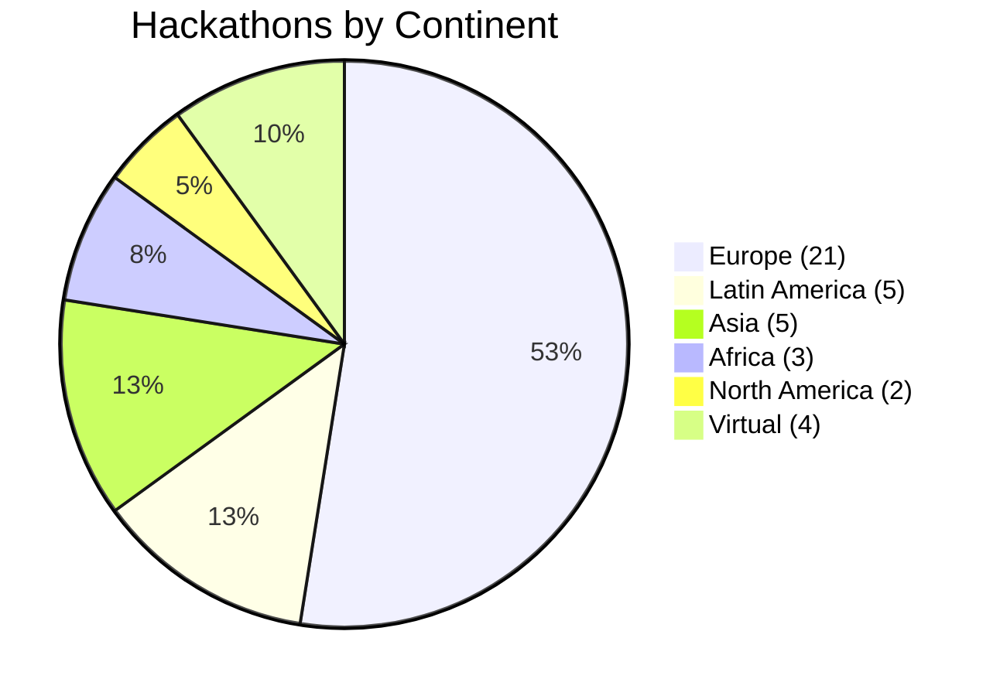

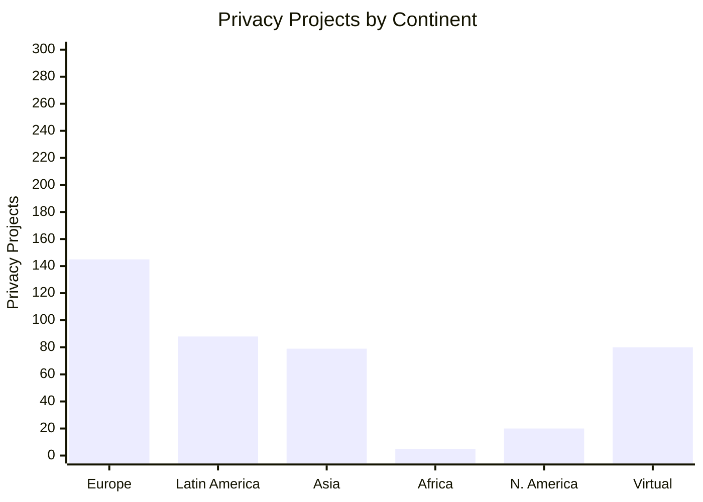

| Continent         | Events | Privacy Projects | Privacy Ratio | Trend         |
| ----------------- | ------ | ---------------- | ------------- | ------------- |
| Europe            | 17     | 145              | 13.1%         | Mature        |
| Latin America     | 8      | 88               | 12.3%         | Emerging      |
| Asia              | 5      | 79               | 8.4%          | Growing       |
| Africa            | 2      | 5                | 6.5%          | Early         |
| North America     | 2      | 20               | 3.9%          | Under-indexed |
| Virtual           | 6      | 80               | 4.3%          | Stable        |

**Regional Insights:**

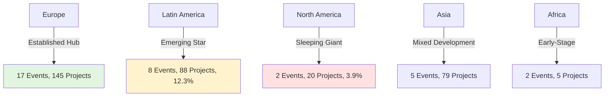

### Top Privacy Intensity Events (Ranked)

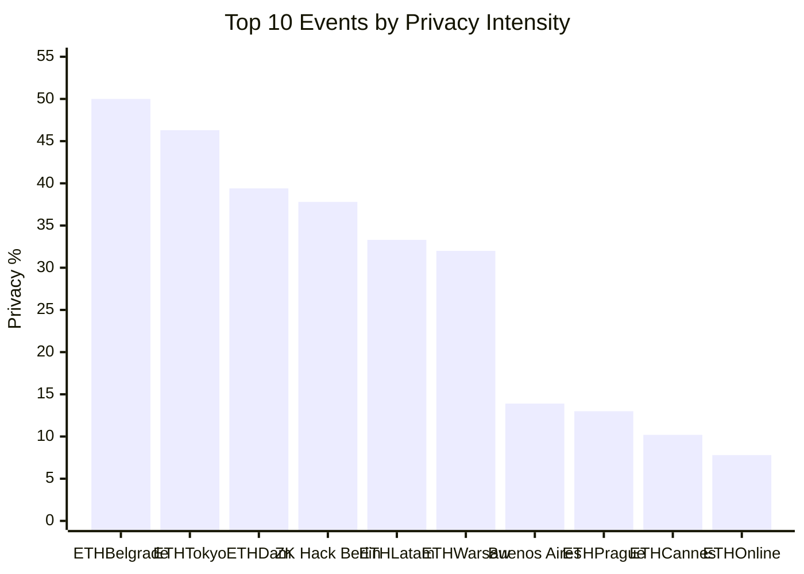

| Rank | Event          | Date   | Privacy % | Privacy Projects | Total Subms. | Region        | Notes                                              |
| ---- | -------------- | ------ | --------- | ---------------- | ------------ | ------------- | -------------------------------------------------- |
| 1    | ETHBelgrade    | 03 Jun | 50.0%     | 10               | 20           | Europe        | Small, specialized event with crypto-academic ties |
| 2    | ETHTokyo       | 15 Sep | 46.3%     | 19               | 41           | Asia          | Strong local cryptography community                |
| 3    | ETHDam         | 09 May | 39.4%     | 13               | 33           | Europe        | Privacy track + ZK pre-workshop                    |
| 4    | ZKHack Berlin  | 20 Jun | 37.8%     | 17               | 45           | Europe        | ZK-focused developer community                     |
| 5    | ETHLatam       | 06 Nov | 33.3%     | 9                | 27           | Latin America | LatAm privacy initiative                           |
| 6    | ETHWarsaw      | 21 Mar | 32.0%     | 16               | 50           | Europe        | Local cryptography research partnerships           |
| 7    | ETHBuenosAires | 21 Nov | 13.9%     | 68               | 488          | Latin America | High absolute count despite lower %                |
| 8    | ETHPrague      | 30 May | 13.0%     | 29               | 223          | Europe        | Regional developer cluster                         |
| 9    | ETHCannes      | 04 Jul | 10.2%     | 35               | 343          | Europe        | Sponsor-driven prizes; good privacy track          |
| 10   | ETHOnline      | 10 Oct | 7.8%      | 51               | 653          | Virtual       | Virtual reach with mixed intensity                 |

**Intensity Score Interpretation:**

- **Exceptional (≥30%)**: Strong specialization and mentor networks; suitable for benchmarking
- **Excellent (15–30%)**: Robust privacy tracks or academic ties
- **Good (8–15%)**: Consistent privacy output but reliant on thematic prompts
- **Fair (<8%)**: Generalist events with lower privacy yields

### IRL vs. Virtual Event Analysis

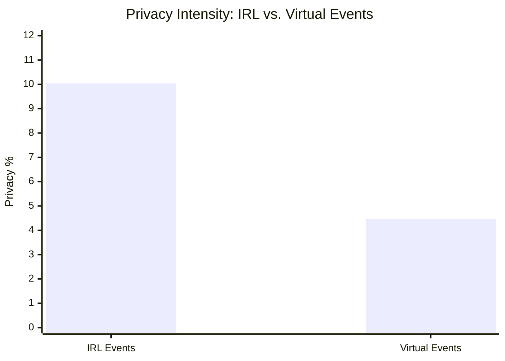

| Format  | Events | Total Submissions | Privacy Projects | Privacy % |
| ------- | ------ | ----------------- | ---------------- | --------- |
| IRL     | 34     | 3,355             | 337              | 10.04%    |
| Virtual | 6      | 1,768             | 79               | 4.47%     |

**Finding:** IRL events produce **2x higher privacy intensity** than virtual events.

**Hypothesis:** In-person hackathons enable:
- Stronger mentor-mentee relationships and real-time technical collaboration
- Spontaneous idea generation through side-events and hallway conversations
- Credible expertise signals from judges and mentors in the "room"

**Implication:** IRL formats should be prioritized for privacy-focused hackathons.

---

## 5. Gap Analysis

### Under-Served Categories vs. Market Potential

| Category                   | Projects | Market Potential   | Gap Size       | Priority     |
| -------------------------- | -------- | ------------------ | -------------- | ------------ |
| Finance                    | 153      | High (established) | Small          | Low          |
| Social                     | 100      | High (growing)     | Small          | Low          |
| AI & Data Privacy          | 51       | Very High          | Medium         | High         |
| Authentication & Identity  | 26       | High               | Medium         | Medium       |
| **DAO / Governance**       | **10**   | **Very High**      | **Large**      | **CRITICAL** |
| **Education & Onboarding** | **2**    | **High**           | **Very Large** | **CRITICAL** |
| Infrastructure & Storage   | 14       | Medium             | Medium         | Medium       |
| **Healthcare & Privacy**   | **12**   | **Very High**      | **Very Large** | **CRITICAL** |
| Analytics & ML             | 1        | High               | Massive        | High         |
| Post-Quantum Crypto        | 1        | High (emerging)    | Massive        | High         |

**Interpretation:** High-potential areas (AI, governance, healthcare) are under-resourced relative to their market and social impact, presenting immediate funding and mentorship opportunities.

---

## Conclusions & Strategic Outlook

### 2025 Privacy Ecosystem: Key Takeaways

1. **Maturity & Momentum**
   - 417 privacy projects across 31 hackathons (8.02% ratio) demonstrate strong, sustained interest
   - Q1→Q4 acceleration (5–12% quarterly growth) signals emerging developer awareness and market tailwinds
   - Privacy is mainstream; no longer niche

2. **Technology Landscape**
   - ZK proofs have achieved critical mass (145 projects, 34.8%)
   - Secondary primitives (MPC, TEE, FHE) remain underutilized despite potential
   - Framework fragmentation (67 custom/unspecified implementations) suggests high innovation but integration overhead

3. **Category Distribution**
   - Finance & Social anchor 62% of projects; strong, mature segments
   - AI-Privacy (51 projects, 12.2%) emerging fastest; 18.7% of all privacy projects now combine AI + privacy
   - Critical gaps in Governance (10 projects), Healthcare (12), Education (2) relative to potential

4. **Geographic Distribution**
   - Europe dominates (52.5% of hackathons, 59% of privacy projects)
   - Latin America emerging as second-tier hub (14.8% privacy intensity > global avg)
   - North America severely under-indexed (5% of hackathons, 4.7% privacy intensity) — major expansion opportunity

5. **IRL > Virtual**
   - In-person hackathons produce 2x higher privacy intensity than virtual (9.47% vs 4.76%)
   - Mentorship, collaboration, and local expertise matter for privacy innovation

---

### Final Notes

This report summarizes hackathon-derived privacy activity from January 2025 through November 2025. The 417 privacy projects across 31 hackathons represent a healthy, growing ecosystem with clear technological maturity in ZK and nascent opportunity in AI-Privacy, Governance, and Healthcare.

---

**Report Compiled:** December 12, 2025  
**Data Coverage:** January 1 – November 30, 2025  
